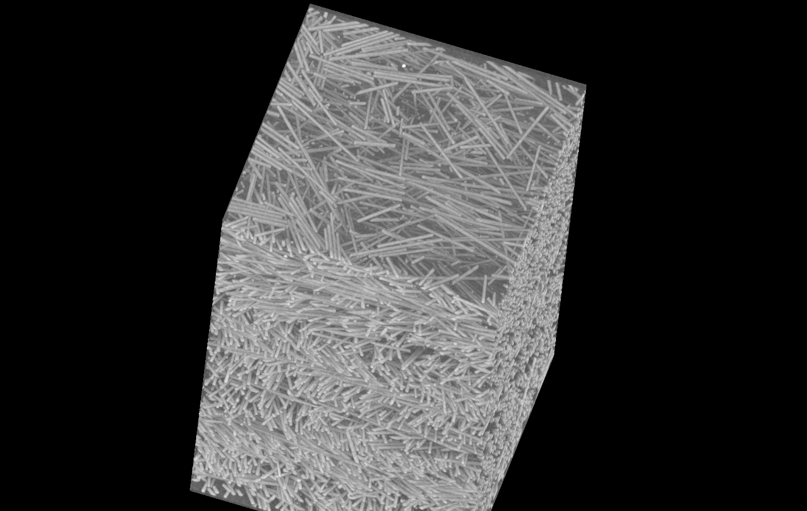

# Tracing Fibers in 3D CT Volume
Trace the short fibes filled in the polymer matrix from the CT 3D volume data
## Work flow: 
```mermaid
flowchart TD
D([Origin Data]) -- correlation operation --> O([orientation field]) -->T
D --> B(binarized mask) --> S(skeleton) --> T(traced fibers)
```
## Issues/Background:
Tracing high-concentrated fibers in the 3D CT images is not an easy work, this repository provides an effecient way to trace fibers based on the orientatin fields obtained by convolve operations.
<!-- toc -->

Due to the high concentration (see [origin data](#origin-data)) of the filled fibers, the fibers tend to interact with each other, and they seemed to be "connected" in the 3D CT images (see [local view](#local-view)). So, the fibers should be traced so that to seperate them from each other during image segmentation operations, so as to obtain correct orientation tensors of the fibers. We utilized the orientation field of the 3D CT data (see file `step1-cal_orientation_field.ipynb` for algorithm details) to trace the fibers successfully (see file `step2-individual_fiber_segmentation.ipynb` for tracing details). And the tracing results is shown in [traced fibers](#traced-fibers).

## Dependencies: 
numpy, scipy, scikit-image, pandas, matplotlib, napari, imageio

## Usage: 
1. The 3D CT data should be stored as ".tiff" files for each slices in one folder, each folder for each volume data.
2. Fill the data folder path in the assignment statement `data_dirs = ["demo_data",]` both in the files `step1-cal_orientation_field.py` and `step2-individual_fiber_segmentation.py`.
3. Run `python -m step1-cal_orientation_field-Copy1.py; python -m step2-individual_fiber_segmentation.py` in the terminal.
4. The results were stored as numpy files `.npy` and HDF5 files `.h5` in the data folders.
<!-- tocstop -->
### origin data

### local view

### traced fibers
