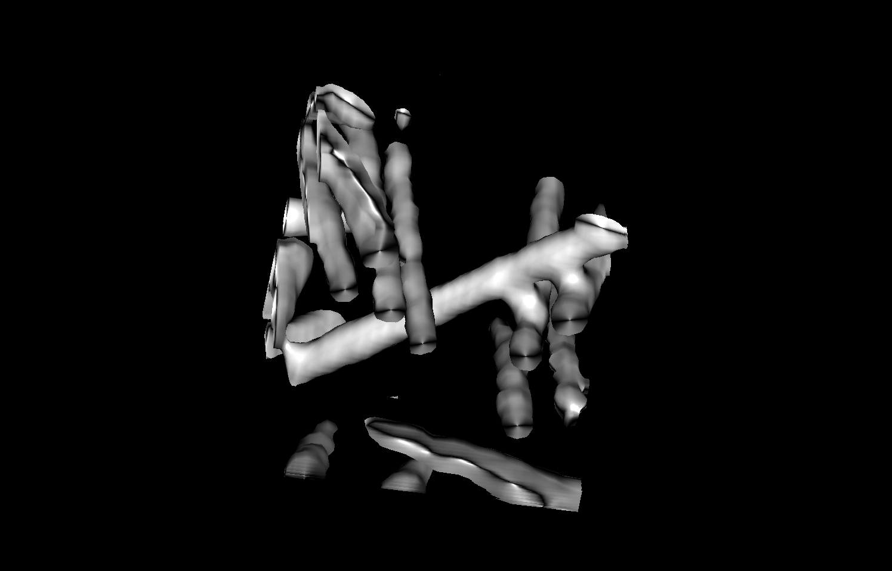

# CT_Fiber Trace
Trace the short fibes filled in the polymer matrix from the CT 3D volume data
# The processing work flow is as below: 
```mermaid
flowchart TD
D([Origin Data]) -- correlation operation --> O([orientation field]) -->T
D --> B(binarized mask) --> S(skeleton) --> T(traced fibers)
```
# About Fiber Tracing
Tracing high-concentrated fibers in the 3D CT images is not an easy work, this repository provides an effecient way to trace fibers based on the orientatin fields obtained by convolve operations.
<!-- toc -->

Due to the high concentration (see [origin data](#origin-data)) of the filled fibers, the fibers tend to interact with each other, and they seemed to be "connected" in the 3D CT images (see [local view](#local-view)). So, the fibers should be traced so that to seperate them from each other during image segmentation operations, so as to obtain correct orientation tensors of the fibers. We utilized the orientation field of the 3D CT data (see file step1-cal_orientation_field-Copy1.ipynb for algorithm details) to trace the fibers successfully (see file step2-individual_fiber_segmentation.ipynb for tracing details). And the tracing results is shown in [final traced lines](#final-traced-lines).
  
<!-- tocstop -->
### origin data

### local view

### final traced lines
